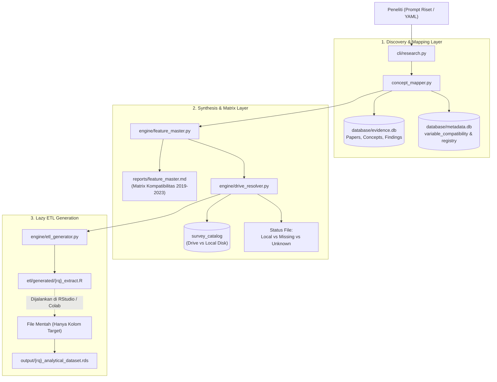

# Research Discovery Engine Architecture

> Platform Riset Terpadu Mikrodata Survei Sosial Ekonomi Nasional (BPS SUSENAS)

---

## 1. Konsep Desain Arsitektur

Research Discovery Engine dirancang dengan prinsip:
1. **Metadata-First**: Meminimalkan pembacaan data mentah (CSV/DBF) berukuran gigabyte dengan memaksimalkan peran basis data metadata dan kamus variabel.
2. **Lazy Selective Extraction**: Menghasilkan kode ETL R yang hanya memuat kolom target (`select = c(...)`) dan menyambungkan tabel via kunci primer `URUT`.
3. **Cross-Year Semantic Alignment**: Memastikan konsistensi komparasi multi-tahun (2019?2023) meskipun kode kuisioner BPS mengalami perubahan blok/penomoran (seperti pada FIES dan Bantuan Sosial).
4. **Evidence-Grounded**: Setiap variabel survei ditautkan dengan temuan penelitian terdahulu yang tervalidasi dalam basis data bukti ilmiah (`evidence.db`).

---

## 2. Diagram Alur Sistem

---

## 3. Komponen Utama

| Modul | Lokasi | Bahasa | Fungsi Utama |
|---|---|:---:|---|
| **Concept Mapper** | `concept_mapper.py` / `engine/concept_mapper.py` | Python | Menerjemahkan frasa bahasa alami ke konsep terstandar dan variabel survei kandidat. |
| **Feature Master** | `engine/feature_master.py` | Python | Menyusun matriks perbandingan variabel lintas tahun (2019-2023) dari `variable_compatibility`. |
| **Drive Resolver** | `engine/drive_resolver.py` | Python | Memverifikasi ketersediaan berkas di Google Drive BPS dan status lokal di storage. |
| **Lazy ETL Generator** | `engine/etl_generator.py` | Python | Menulis skrip R reproduktif untuk seleksi kolom dan penggabungan tabel berbasis `URUT`. |
| **Research CLI** | `cli/research.py` | Python | Antarmuka CLI interaktif untuk mengeksekusi pipeline dari query atau berkas spesifikasi YAML. |
| **Search CLI** | `cli/search.py` | Python | Mesin pencari cepat untuk mengeksplorasi variabel, paper ilmiah, dan katalog survei. |
